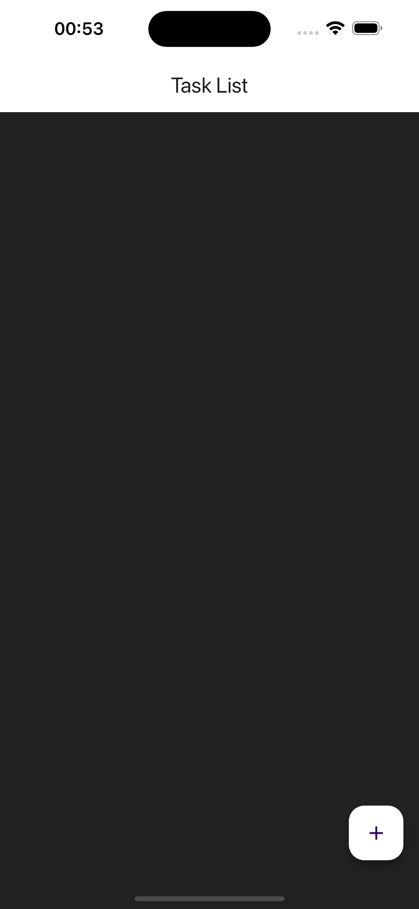
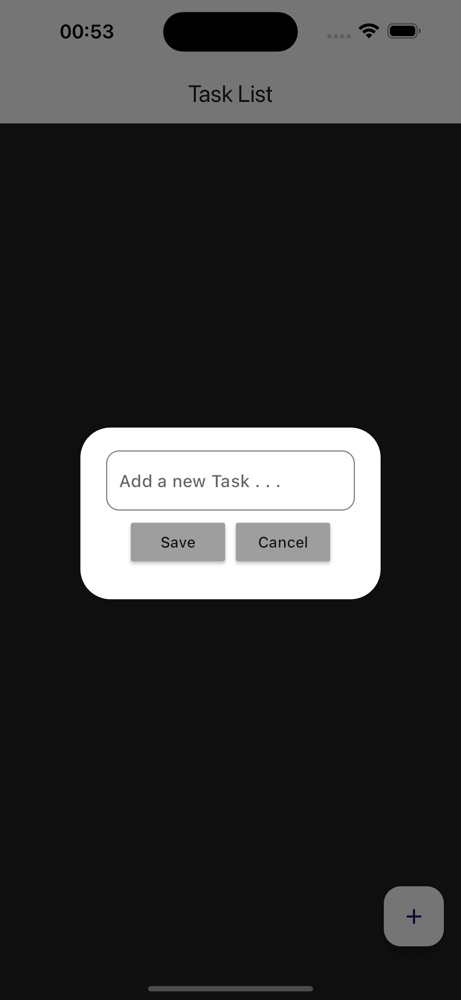
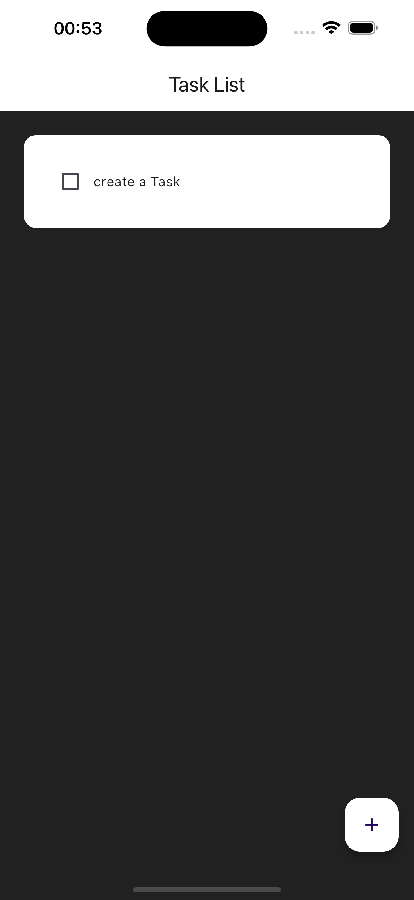
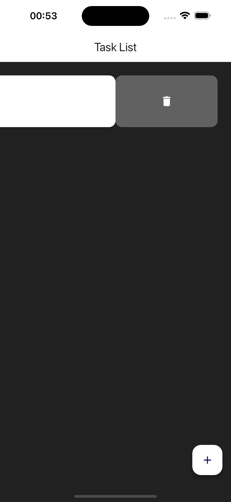

# ToDo App

            

A simple and aesthetic ToDo app built with Dart and Flutter. 
This app allows users to create new tasks, mark them as completed, 
and delete them as needed. Perfect for anyone looking for a minimalist and 
user-friendly task management solution.

---------------------------------------------------------------------------------------------------------------------------

Features:

- Create New Tasks: Add new tasks to your ToDo list.
- Mark Tasks as Completed: Mark tasks that you have finished.
- Delete Tasks: Remove tasks that you no longer need.
- Simple and Aesthetic Design: Enjoy a minimalist and visually appealing design focused on ease of use.

---------------------------------------------------------------------------------------------------------------------------

Installation:

1. Install Flutter: Ensure Flutter is installed on your system.

2. Clone the Repository:

  - git clone https://github.com/your-username/todo-app.git

3. Install Dependencies:

  - cd todo-app
  - flutter pub get

4. Run the App:

  - flutter run

---------------------------------------------------------------------------------------------------------------------------

Contributions:

Contributions are welcome! Please open an issue to report bugs or suggest new features. Pull requests are also appreciated.

---------------------------------------------------------------------------------------------------------------------------

License:

This project is licensed under the MIT License. See the LICENSE file for details.
